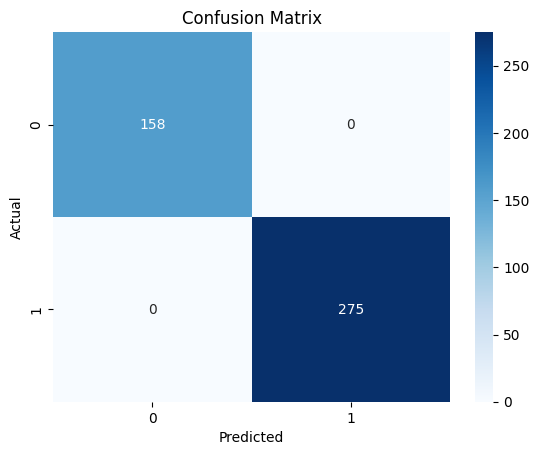
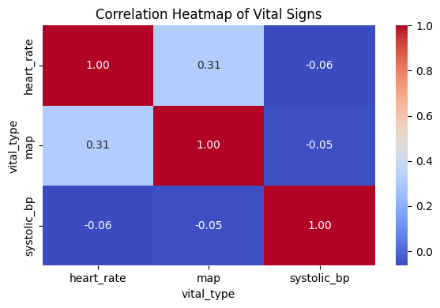
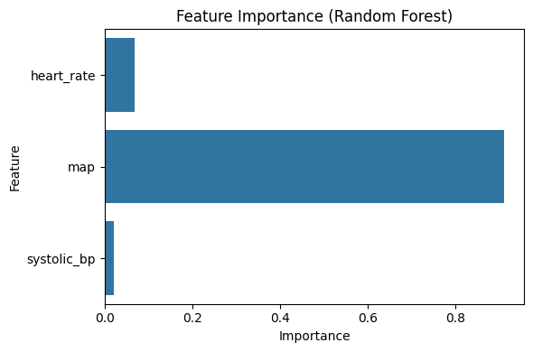
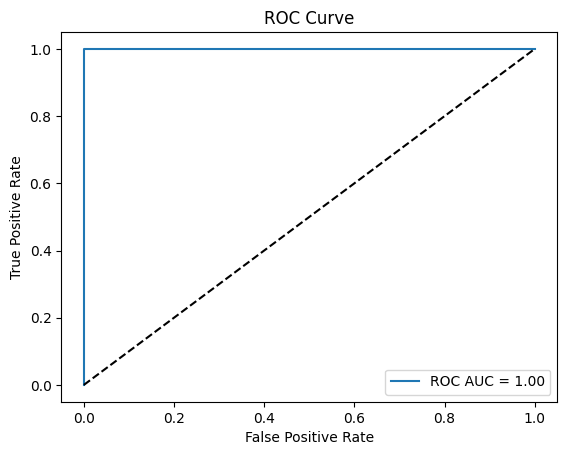
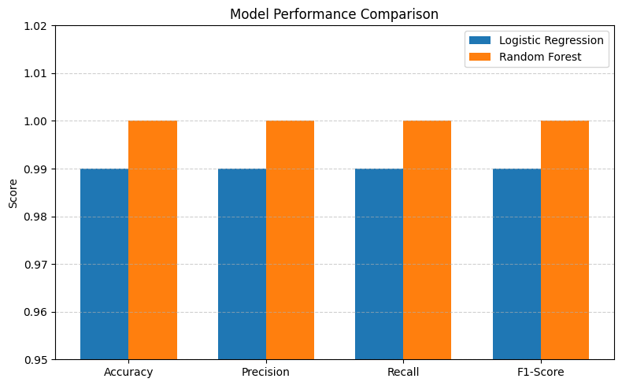
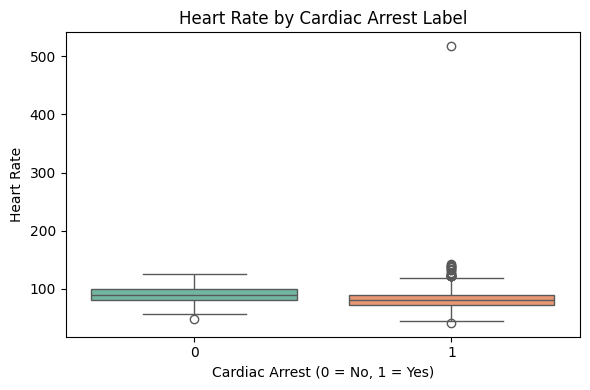
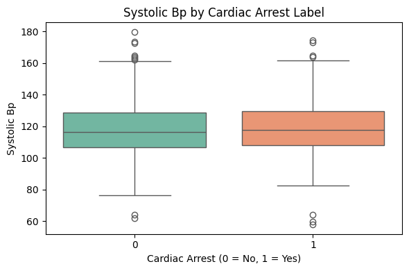
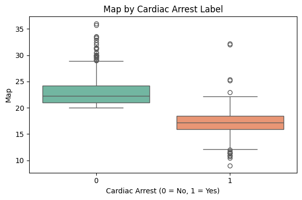

# Cardiac Arrest Prediction in ICU Patients

## 📌 Overview
This project builds a machine learning-based system to predict the risk of cardiac arrest in ICU patients using clinical data from the MIMIC-IV dataset. The goal is to assist early detection and improve clinical decision-making.

---

## 🚀 Features
- 📊 Uses 40+ clinical features (vital signs, lab values)
- 🤖 Machine Learning Models:
  - Random Forest (Primary Model)
  - Logistic Regression (Baseline)
- 🎯 Optimized for high recall (critical in healthcare)
- 🌐 Flask-based web application for real-time prediction
- 📄 Automated PDF report generation
- ⚡ Instant patient risk prediction

---

## 🧠 Model Performance

### 🔹 Random Forest
- Accuracy: 1.00  
- Precision: 1.00  
- Recall: 1.00  
- F1-Score: 1.00  
- ROC-AUC: 1.00  

### 🔹 Logistic Regression
- Accuracy: 0.99  
- Precision: 0.99  
- Recall: 0.99  
- F1-Score: 0.99  

---

## 📊 Project Visualizations

### 🔹 Confusion Matrix


### 🔹 Correlation Heatmap


### 🔹 Feature Importance


### 🔹 ROC Curve


### 🔹 Model Performance Comparison


### 🔹 Heart Rate Analysis


### 🔹 Systolic Blood Pressure


### 🔹 Map Visualization


---

## ⚙️ Tech Stack
- Python 🐍  
- Scikit-learn  
- Pandas & NumPy  
- Matplotlib & Seaborn  
- Flask (Web App)  
- ReportLab (PDF Generation)  

---

## 🚀 How to Run

```bash
git clone https://github.com/Sahildas2003/Prediction-Of-Cardiac-Arrest.git
cd Prediction-Of-Cardiac-Arrest
pip install -r requirements.txt
python CardiacApp/app.py
